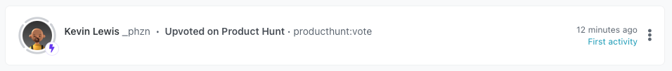
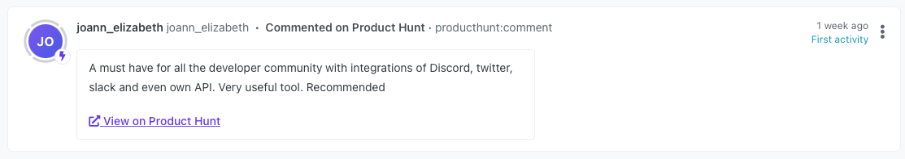

# Product Hunt to Orbit Workspace


[](https://badge.fury.io/js/%40orbit-love%2Fproducthunt)
[](.github/CODE_OF_CONDUCT.md)

This is a JavaScript package that can be used to integrate new Product Hunt votes and comments into your organization's Orbit workspace.




|<p align="left">:sparkles:</p> This is a *community project*. The Orbit team does its best to maintain it and keep it up to date with any recent API changes.<br/><br/>We welcome community contributions to make sure that it stays current. <p align="right">:sparkles:</p>|
|-----------------------------------------|


## First Time Setup
1. Log in to Product Hunt
2. Create a new [Product Hunt API Application](https://www.producthunt.com/v2/oauth/applications)
  1. Redirect URI can be any web address
  2. Take note of your API Key and API Secret

## Application Credentials

The application requires the following environment variables:

| Variable | Description | More Info
|---|---|--|
| `PRODUCT_HUNT_API_KEY` | API Key for your Product Hunt Application | Follow the guide above
| `PRODUCT_HUNT_API_SECRET` | API Secret for your Product Hunt Application | Follow the guide above
| `ORBIT_API_KEY` | API key for Orbit | Found in `Account Settings` in your Orbit workspace
| `ORBIT_WORKSPACE_ID` | ID for your Orbit workspace | Last part of the Orbit workspace URL, i.e. `https://app.orbit.love/my-workspace`, the ID is `my-workspace`

## Package Usage

Install the package with the following command

```
$ npm install @orbit-love/producthunt
```

The standard initialization of the library requires the following signature:

```js
const OrbitProductHunt = require('@orbit-love/producthunt')
const orbitProductHunt = new OrbitProductHunt('orbitWorkspaceId', 'orbitApiKey', 'productHuntApiKey', 'productHuntApiSecret')
```

If you have the following environment variables set: `ORBIT_WORKSPACE_ID`, `ORBIT_API_KEY`, `PRODUCT_HUNT_API_KEY`, and `PRODUCT_HUNT_API_SECRET` then you can initialize the client as follows:

```js
const OrbitProductHunt = require('@orbit-love/producthunt')
const orbitProductHunt = new OrbitProductHunt()
```

### Get Product IDs Made By A User

```js
const products = await orbitProductHunt.getProducts('_phzn')
console.log(products)
```

### Add New Votes On Product

```js
const votes = await orbitProductHunt.getVotes(productId)
const prepared = await orbitProductHunt.prepareVotes(votes, 24) // 24 is the number of previous hours to get votes from
const outcome = await orbitProductHunt.addActivities(prepared)
console.log(outcome)
```

### Add New Comments On Product

```js
const votes = await orbitProductHunt.getComments(productId)
const prepared = await orbitProductHunt.prepareComments(votes, 24) // 24 is the number of previous hours to get votes from
const outcome = await orbitProductHunt.addActivities(prepared)
console.log(outcome)
```


## CLI Usage

To use this package you do not need to install it, but will need Node.js installed on your machine.

```bash
npx @orbit-love/producthunt --products --user=username

# Add new votes or comments
npx @orbit-love/producthunt --votes --id=projectid
npx @orbit-love/producthunt --comments --id=projectid

# Add new votes and comments
npx @orbit-love/producthunt --votes --comments --id=projectid
```

By default this will get the last 1 hours worth of votes, but this can be explicitly overridden:

```
npx @orbit-love/producthunt --votes --id=projectid --hours=12
```

## GitHub Actions Automation Setup

⚡ You can set up this integration in a matter of minutes using our GitHub Actions template. It will run regularly to add new activities to your Orbit workspace. All you need is a GitHub account.

[See our guide for setting up this automation](https://github.com/orbit-love/github-actions-templates/blob/main/ProductHunt)

## Contributing

We 💜 contributions from everyone! Check out the [Contributing Guidelines](.github/CONTRIBUTING.md) for more information.

## License

This project is under the [MIT License](./LICENSE).

## Code of Conduct

This project uses the [Contributor Code of Conduct](.github/CODE_OF_CONDUCT.md). We ask everyone to please adhere by its guidelines.
